# 🔍 CareerLens

<div align="center">

[](https://python.org)
[](https://streamlit.io)
[](https://www.sqlalchemy.org)
[](https://www.latex-project.org)
[](LICENSE)

**An intelligent job market analytics, explainable candidate matching, and ATS resume optimization platform.**

[Key Features](#-core-features) • [Architecture](#-system-architecture) • [Getting Started](#-installation--quickstart) • [Tech Stack](#-tech-stack) • [Power BI Integration](#-power-bi-portfolio-integration)

</div>

---

## 📌 Overview & Vision

**CareerLens** bridges the gap between job seekers and real-world employment markets. Rather than acting as a generic resume builder or opaque black-box matcher, CareerLens operates as an **analytical intelligence engine** providing complete transparency into candidate-market alignment:

```
[Candidate Profile / Resume]  ←────────  CareerLens  ────────→  [Live Job Market Data]
                                               │
               ┌───────────────────────────────┼───────────────────────────────┐
               ▼                               ▼                               ▼
       Pillar 1: Market Intelligence     Pillar 2: Candidate Fit       Pillar 3: Resume Intelligence
       • 1,050+ Market Postings          • Explainable Weighted Match  • 5 Industry ATS LaTeX Templates
       • Skill Demand & Velocity         • Diagnostic Skill Gap Engine • Anti-Hallucination STAR Rewriter
       • Co-occurrence Matrix            • Market Priority Scoring     • Dual-Engine PDF Generation
       • Transparent Salary Bands        • Actionable Upskilling Steps • Instant .tex & PDF Exports
```

> [!NOTE]
> **Product Scope:** CareerLens is an analytical career and resume optimization engine. It is **not** an ATS or job application aggregator. When candidates find matching roles, they are redirected directly to official company career portals (`Apply on Source`).

---

## ✨ Core Features

### 1. 📊 Job & Market Intelligence
- **Macro Market Insights:** Aggregate analysis over 1,050+ vetted job postings across 10 core tech domains and 100+ global employers.
- **Skill Demand Heatmaps & Velocity:** Longitudinal tracking of tech stack requirements (SQL, Python, AWS, Docker, Power BI, etc.).
- **Skill Co-Occurrence Engine:** Discover high-frequency skill pairs (e.g., `Python + PyTorch`, `SQL + Power BI + DAX`).
- **Data-Driven Compensation Analytics:** Realistic salary percentiles (25th, Median, 75th, 90th) grouped by seniority and employment type.

### 2. 🎯 Explainable Candidate Fit & Match Engine
- **Multi-Format Document Parsing:** Ingests PDF, DOCX, and TXT resumes with automated text normalization.
- **Canonical Skill Taxonomy:** Normalizes 200+ technology keywords and aliases into unified skill nodes (e.g., `PowerBI`, `MS Power BI` $\rightarrow$ `Power BI`).
- **Mathematical, Explainable Match Scoring:** Zero black-box magic. Scores (0–100%) are calculated deterministically:
  $$\text{Match Score} = (\text{Skill Match} \times 0.45) + (\text{Semantic Similarity} \times 0.20) + (\text{Experience} \times 0.15) + (\text{Education} \times 0.10) + (\text{Keywords} \times 0.10)$$
- **Diagnostic Skill Gap Engine:** Highlights exact missing skills vs. target roles, ranked by market priority and hiring demand.

### 3. 📄 ATS Resume Engineering & LaTeX Generation
- **5 Professionally Engineered LaTeX Templates:**
  1. `modern_ats.tex`: Universal corporate single-column ATS layout.
  2. `data_analyst_ats.tex`: Tailored for analysts, highlighting tools, dashboards, SQL, and business metrics.
  3. `student_ats.tex`: Prioritizes academic coursework, degree timeline, and technical projects.
  4. `professional_ats.tex`: Structured for senior engineers and leadership impact.
  5. `minimalist_ats.tex`: High-density, clean typography maximizing space efficiency.
- **Anti-Hallucination AI Optimizer:** Rewrites bullet points using the **STAR/XYZ format** (`Accomplished [X], measured by [Y], by doing [Z]`) strictly using verified user facts without inventing metrics or experience.
- **Dual-Engine PDF Compilation:** Compiles directly via system LaTeX (`pdflatex` / `xelatex`) when present, with automatic fallback to **ReportLab PDF**, ensuring 100% download reliability anywhere.

### 4. 🤖 Contextual Career Advisor AI
- **Grounded Career Consultation:** Conversational AI advisor powered by Google Gemini / OpenAI (or intelligent offline Mock Provider) grounded in the candidate's active profile and current job market context.

---

## 🏗️ System Architecture

```mermaid
flowchart TD
    subgraph UI ["User Interface (Streamlit Multi-Page)"]
        Landing["app.py (Landing & Navigation)"]
        P1["01 Dashboard"]
        P2["02 Find Jobs"]
        P3["03 CV Analyzer"]
        P4["04 Job Matcher"]
        P5["05 Skill Gap Engine"]
        P6["06 Market Intelligence"]
        P7["07 Job Comparison"]
        P8["08 Resume Builder"]
        P9["09 My Resumes"]
        P10["10 Career AI"]
    end

    subgraph Backend ["Analytical Backend Services (backend/)"]
        CP["cv_parser.py"]
        JP["jd_parser.py"]
        SE["skill_extractor.py"]
        SN["skill_normalizer.py"]
        JM["job_matcher.py"]
        SG["skill_gap_engine.py"]
        ME["market_engine.py"]
        SE_ENG["salary_engine.py"]
        RO["resume_optimizer.py"]
        AA["ats_analyzer.py"]
        LG["latex_generator.py"]
    end

    subgraph AI ["AI & LLM Services (ai/)"]
        LLM["llm_provider.py (Gemini / OpenAI / Mock)"]
        RAG["rag.py (Context Retrieval)"]
        PR["prompts.py (Anti-Hallucination Rules)"]
    end

    subgraph Storage ["Database & Datasets (database/ & data/)"]
        ORM["SQLAlchemy ORM (models.py)"]
        DB[("SQLite / PostgreSQL")]
        CSV_JOBS[("sample_jobs.csv")]
        CSV_SKILLS[("skills.csv")]
    end

    UI --> Backend
    Backend --> AI
    Backend --> Storage
    AI --> Storage
```



---

## 📂 Project Structure

```text
CareerLens/
├── app.py                      # Application entry point & primary navigation
├── pages/                      # Multi-page Streamlit application modules
│   ├── 01_dashboard.py         # Candidate overview & high-level metrics
│   ├── 02_find_jobs.py         # Market job board with multi-attribute filtering
│   ├── 03_cv_analyzer.py       # CV document parsing & ATS audit
│   ├── 04_job_matcher.py       # Deterministic candidate-to-job matching
│   ├── 05_skill_gap.py         # Diagnostic missing skill breakdown & steps
│   ├── 06_market_intelligence.py # Macro trends, co-occurrence, salary percentiles
│   ├── 07_job_comparison.py    # Side-by-side job role comparison
│   ├── 08_resume_builder.py    # Interactive LaTeX resume generator
│   ├── 09_my_resumes.py        # Resume version history & downloads
│   └── 10_career_ai.py         # Grounded GenAI career advisor chat
├── backend/                    # Core business logic & algorithms
│   ├── ats_analyzer.py         # ATS formatting and heuristic evaluation
│   ├── candidate_profile.py    # Profile completeness calculator
│   ├── career_assistant.py     # Grounded career consultation handler
│   ├── cv_parser.py            # PDF/DOCX multi-engine document parser
│   ├── jd_parser.py            # Job description requirement parser
│   ├── job_matcher.py          # Programmatic multi-factor match formula
│   ├── latex_generator.py      # Jinja2 template rendering + LaTeX compiler
│   ├── market_engine.py        # Aggregation and analytics engine
│   ├── resume_optimizer.py     # STAR/XYZ bullet rewriter
│   ├── salary_engine.py        # Compensation and percentile calculator
│   ├── skill_extractor.py      # Boundary-safe regex skill extractor
│   ├── skill_gap_engine.py     # Categorized skill gap prioritization
│   └── skill_normalizer.py     # Canonical taxonomy and alias mapper
├── ai/                         # LLM abstraction & prompt engineering
│   ├── embeddings.py           # Text embedding and vector similarity
│   ├── llm_provider.py         # Multi-provider client (Gemini / OpenAI / Mock)
│   ├── prompts.py              # Strict system prompts preventing hallucination
│   ├── rag.py                  # Profile & market context assembler
│   └── structured_output.py    # Pydantic schema validation
├── database/                   # Persistence layer
│   ├── database.py             # SQLAlchemy engine & session manager
│   ├── models.py               # ORM models (Job, Skill, Candidate, Resume)
│   ├── repositories.py         # CRUD repository pattern abstraction
│   ├── schemas.py              # Pydantic data validation schemas
│   └── seed.py                 # Automated DB seeder with verified datasets
├── templates/                  # ATS LaTeX templates
│   ├── modern_ats.tex          # Clean modern corporate template
│   ├── data_analyst_ats.tex    # Analytics & data engineering template
│   ├── student_ats.tex         # Student & early career project template
│   ├── professional_ats.tex    # Senior executive & progression template
│   └── minimalist_ats.tex      # High-density typographic template
├── powerbi/                    # Business Intelligence integration
│   ├── dax_measures.md         # Production DAX measures for Power BI
│   └── powerbi_guide.md        # Step-by-step reporting setup guide
├── data/                       # Datasets & taxonomies
│   ├── sample_jobs.csv         # 1,050 curated real-world job records
│   ├── skills.csv              # 200+ canonical technical & domain skills
│   └── skill_categories.csv    # Categorical classification hierarchy
├── utils/                      # Helper utilities
│   ├── docx_utils.py           # Word document processing
│   ├── file_utils.py           # Safe file operations & buffer handler
│   ├── pdf_utils.py            # PyPDF text extraction & cleanup
│   ├── text_utils.py           # Regex extraction & text sanitization
│   ├── ui_helpers.py           # Streamlit CSS styling & reusable widgets
│   └── validation.py           # LaTeX injection prevention & input safety
├── tests/                      # Pytest unit & integration test suite
│   ├── test_cv_parser.py
│   ├── test_database.py
│   ├── test_matcher.py
│   ├── test_resume_generator.py
│   └── test_skill_extractor.py
├── requirements.txt            # Python dependencies
├── Dockerfile                  # Container definition
├── docker-compose.yml          # Container orchestration
└── README.md
```

---

## 💻 Installation & Quickstart

### Prerequisites
- **Python 3.11, 3.12, or 3.13**
- *(Optional)* TeX Live / MiKTeX if native LaTeX compilation is desired (ReportLab fallback works out of the box).

### 1. Clone the Repository
```bash
git clone https://github.com/Kartik-Gore/CareerLens.git
cd CareerLens
```

### 2. Set Up a Virtual Environment
```bash
# Windows (PowerShell)
python -m venv .venv
.\.venv\Scripts\Activate.ps1

# macOS / Linux
python3 -m venv .venv
source .venv/bin/activate
```

### 3. Install Dependencies
```bash
pip install -r requirements.txt
```

### 4. Configure Environment Variables
Create a `.env` file in the root directory (or copy from `.env.example`):
```ini
# Optional: Provide an API key for live AI capabilities
# If left empty, CareerLens operates seamlessly using the built-in Mock Provider
GEMINI_API_KEY=your_gemini_api_key_here
# or
OPENAI_API_KEY=your_openai_api_key_here

# Database Configuration (defaults to SQLite: careerlens.db)
DATABASE_URL=sqlite:///careerlens.db
```

### 5. Seed the Database
Initialize the database with 1,050+ job records and 200+ skills:
```bash
python database/seed.py
```

### 6. Run the Application
```bash
streamlit run app.py
```
Open your browser at **`http://localhost:8501`**.

---

## 🐳 Docker Deployment

Run CareerLens via Docker:

```bash
docker compose up --build
```
The application will be live at `http://localhost:8501`.

---

## 🧪 Testing Suite

CareerLens maintains test coverage across parsing, matching algorithms, database persistence, and LaTeX generation:

```bash
python -m pytest tests/ -v
```

### Test Scope:
- **CV Parsing:** Contact details extraction, section segmentation, fallback behavior.
- **Skill Extraction:** Word-boundary protection, case-insensitivity, canonical normalization.
- **Matching Algorithm:** Deterministic math weighting, edge cases, partial matches.
- **LaTeX Safety:** Character escaping against LaTeX injection (`&`, `%`, `$`, `#`, `_`, `{`, `}`).
- **Database Repositories:** Full CRUD operations and relational query integrity.

---

## 📊 Power BI Portfolio Integration

CareerLens includes ready-to-use assets for Business Intelligence portfolios:
- **Pre-formatted Datasets:** `data/sample_jobs.csv` and `data/skills.csv`
- **Engineered DAX Formulas (`powerbi/dax_measures.md`):**
  - Total Jobs, Active Companies, Remote Work Ratio
  - Skill Demand Frequency %, Average and Median Salaries
  - Month-over-Month Job Market Growth via Time Intelligence
- **Power BI Implementation Blueprint (`powerbi/powerbi_guide.md`):** Detailed guide to building 5 enterprise dashboard pages.

---

## 🛡️ Security & Anti-Hallucination Policy

1. **Zero Raw Document Persistence:** Uploaded resume files are processed in-memory and discarded unless the user explicitly saves a parsed profile.
2. **LaTeX Injection Prevention:** All dynamically injected user content passes through `sanitize_latex_string()`, preventing malicious code execution or broken document builds.
3. **Strict STAR/XYZ Grounding:** AI prompts enforce strict guardrails: the system refines phrasing and clarity without ever fabricating employers, degrees, metrics, or technologies.
4. **Credential Isolation:** API keys remain strictly server-side and are never exposed in user sessions or exports.

---

## 🤝 Contributing

Contributions, issues, and feature requests are welcome!
1. Fork the Project
2. Create your Feature Branch (`git checkout -b feature/AmazingFeature`)
3. Commit your Changes (`git commit -m 'Add some AmazingFeature'`)
4. Push to the Branch (`git push origin feature/AmazingFeature`)
5. Open a Pull Request

---

## 📜 License

Distributed under the **MIT License**. See [`LICENSE`](LICENSE) for more information.

---

<div align="center">
Developed with ❤️ by <a href="https://github.com/Kartik-Gore">Kartik Gore</a>
</div>
